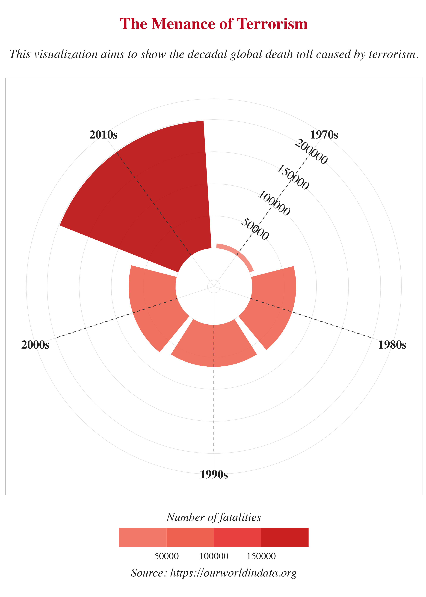
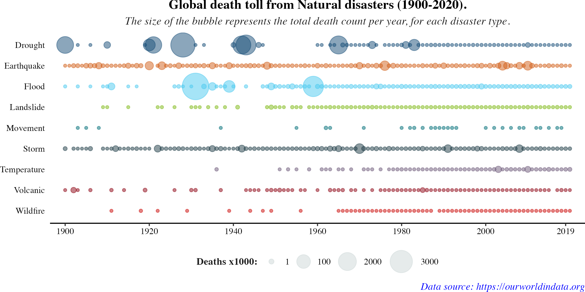
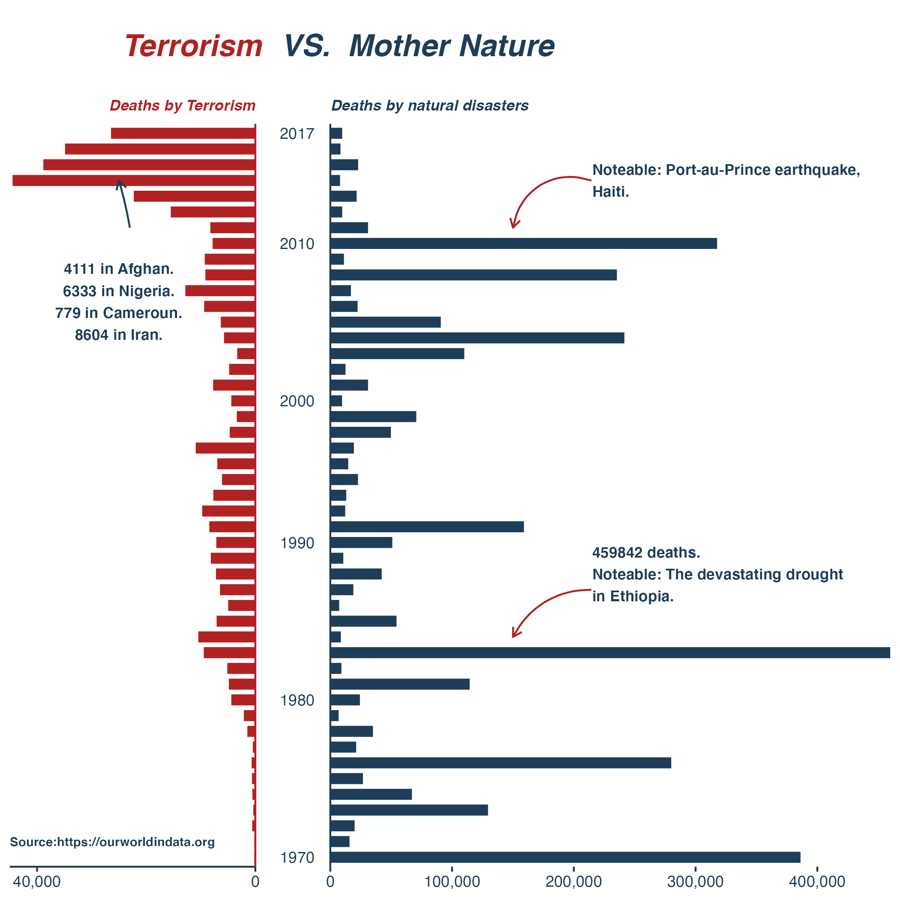

TITLE: Mother Earth vs Terrorism 

INTRODUCTION
High impact deaths caused by an event such as terrorism usually makes headlines, heightens tension among the population and leads to more precautionary measures which in turn reduce the likelihood of such events occurring. While this is very commendable, there are other causes of death (in this context, natural disasters) which may not make as much headlines as a high impact one like terrorism. The objective of my visualization is to compare the deaths caused by natural disasters against that caused by Terrorism across the globe. While I am in full support of the media coverage terrorism attracts, the aim of my visualization is to show reasons why deaths caused by natural disasters should also receive as much media attention. Not for the sake of scaring people, but for the sake of ensuring leaders, stakeholders and key decision makers are pressured into taking proactive steps to mitigate the future risks of natural disasters.

ABOUT MY DATA
For this project, I use two data sets both gotten from https://ourworldindata.org. 

APPROACH
I approached this project the following way. 
Step 1: I first created a visualization for the deaths in terrorism. I used a circular bar plot for this visualization. I was inspired by these visualizations; https://www.r-graph-gallery.com/circular-barplot.html. My codes are completely different from this plot as my data is different and I had to carry out other different manipulations.

Step 2: I create a scatter plot to show the deaths caused by natural disasters. Because there are different segments of natural disasters, my chart shows deaths broken down into each segment. I got inspiration for this plot from https://ourworldindata.org/natural-disasters?country=. The codes were written by me and not copied.

Step 3: I created a table summarizing the total decadal deaths due to natural disasters and terrorism.

Step 4: For this final plot, I combined three separate plots into one. My inspiration was from a plot by https://public.tableau.com/app/profile/osmguy/viz/50YearsofAFCvsNFCMatchups/50YearsofAFCvs_NFCMatchups. I simply recreated this plot in R using several tricks. The codes were written by me and not copied.

# I create my summary table before the third effort

```{r setup, include=FALSE}
knitr::opts_chunk$set(echo = TRUE)
```

All these packages will be needed.
```{r}
library(tidyverse)
library(broom)
library(purrr)
library(plotly)
library(stringr)
library(scales)
library(cowplot)
library(huxtable)
library(qwraps2)
```


Load the datasets
```{r}
deaths_terrorism <- read_csv("data/fatalities-from-terrorism.csv")

deaths_disasters <- read_csv("data/number-of-deaths-from-natural-disasters.csv")
```


# Effort 1
# I will start with the deaths by terrorism dataset
```{r}
deaths_terrorism <- deaths_terrorism %>%
  filter(!(Entity == "International")) %>%
  rename(deaths = "Terrorism fatalities (GTD, 2018)") %>%
  # I will make the column `Year` categorical
  mutate(Year = as.character(Year))
```

Looking at the dataset, Countries are stored under the Entity column. 

Observation: We have a mixture of countries, and continents in our dataset. We also have duplicated countries. Let's separate these. First of all, I have to manually identify the continents in the dataset. They are:
(Australasia & Oceania, Central America & Caribbean, Central Asia, East Asia, Eastern Europe, International, Middle East & North Africa, North America, South America, South Asia, Southeast Asia, Sub-Saharan Africa, Western Europe)

Knowing these will help us in performing continent specific analysis.


# Observation
We have a `World` variable in the Entity column. We can simply use this to visualize the global fatalities.
```{r}
deaths_terrorism %>%
  filter(Entity == "World") -> global_deaths_terro
```


I would like to ensure the deaths from the World Entity equals the deaths of all the countries of the world. So I will get the fatality by country, group it by year and sum it.
```{r}
deaths_terrorism %>%
  filter(!(Entity %in% c("Australasia & Oceania", "Central America & Caribbean", "Central Asia", "East Asia", "Eastern Europe", "Middle East & North Africa", "North America", "South America", "South Asia", "Southeast Asia", "Sub-Saharan Africa", "Western Europe", "Western Sahara", "World"))) %>% group_by(Year) %>%
  summarise(deaths = sum(deaths)) -> deaths_terro_country
```


I then compare the differences.
```{r}
diff_deaths <- tibble(year = global_deaths_terro$Year,
                      deaths_world = global_deaths_terro$deaths,
                      deaths_country = deaths_terro_country$deaths,
                      diff = deaths_world - deaths_country)
```
# Conclusion
I can conclude both groups of data are similar. The data can be trusted.


Since I am producing a chart showing decadal death toll, I will first group the dataset by decades.
```{r}
global_deaths_terro %>%
  select(c(Year, deaths)) %>%
  mutate(Year = as.double(Year)) %>%
  mutate(Decade = case_when(
    Year %in% c(1970:1979) ~ "1970s",
    Year %in% c(1980:1989) ~ "1980s",
    Year %in% c(1990:1999) ~ "1990s",
    Year %in% c(2000:2009) ~ "2000s",
    Year %in% c(2010:2019) ~ "2010s"
  )) %>%
  group_by(Decade) %>%
  summarise(Deaths = sum(deaths)) -> decadal_terro_death
```


# I can now go ahead to make the Circular Barplot
```{r}
decadal_terro_death %>%
  ggplot() +
  geom_col(aes(x = Decade,
               y = Deaths,
               fill = Deaths),
           position = "dodge2",
           show.legend = TRUE,
           alpha = .9) +
  theme_light() +
  # I transform the chart to a circular chart
  coord_polar() +
  # Manual annotations to replace the y-axis. Will help in showing amount of deaths for each polar axis
  annotate(x = "1970s",
           angle = -35,
           y = 50800,
           label = "50000",
           geom = "text",
           color = "gray12",
           family = "serif",
           size = 6.5) +
  annotate(x = "1970s",
           angle = -35,
           y = 100800,
           label = "100000",
           geom = "text",
           color = "gray12",
           family = "serif",
           size = 6.5) +
   annotate(x = "1970s",
           angle = -35,
           y = 150800,
           label = "150000",
           geom = "text",
           color = "gray12",
           family = "serif",
           size = 6.5) +
  annotate(x = "1970s",
           angle = -35,
           y = 200000,
           label = "200000",
           geom = "text",
           color = "gray12",
           family = "serif",
           size = 6.5) +
  # I scale the y-axis so the chart doesn't start from the bottom
  scale_y_continuous(limits = c(-60000, 200000), 
                     expand = c(0, 0)) +
  # I can now fill the legend for number of deaths per decade
  scale_fill_gradientn("Number of fatalities",
                       colours = c("#f38375", "#ef6351", "#e5383b", "#ba0c0c")) +
  # I will make the color guide discrete
  guides(fill = guide_colorsteps(barwidth = 20, barheight = 2.0, 
                                 title.position = "top", title.hjust = .5)) +
  theme(legend.position = "bottom",
        axis.title = element_blank(),
        axis.ticks = element_blank(),
        axis.text.y = element_blank(),
        axis.text.x = element_text(color = "gray12", size = 18, face = "bold"),
        legend.text = element_text(size = 15),
        legend.title = element_text(size = 18, face = "italic"))  +
  # add labels
  labs(title = "The Menance of Terrorism",
    subtitle = "\nThis visualization aims to show the decadal global death toll caused by terrorism.\n",
    caption = "Source: https://ourworldindata.org") +
  # Customize general theme
  theme(text = element_text(color = "gray12", family = "serif"),
    plot.title = element_text(face="bold", size = 25, hjust = 0.5, color="#bb0a21"),
    plot.subtitle = element_text(size = 19, hjust = 0.5, face = "italic"),
    plot.caption = element_text(size = 18, hjust = .5, face = "italic")) -> plot1
```

To save the plot
# ggsave("data/plot.png", plot1, width=9, height=12.6)


# Effort 1
```{r, echo=FALSE, out.width="50%", fig.cap="The Menance of Terrorism"}

```
Comment: 
(Data ink ratio) I considered removing the circular axis text for number of deaths since there is already a color legend under. But, I ignored that because the deaths from 1970s - 2000s were all low and hence, they fell under one color gradient. Relying on color won't help someone to really differentiate the number of deaths. I also considered adding an annotation instead of an axis, but I couldn't figure out how to annotate while maintaining the current state of the chart.


# Effort 2: Global deaths from Natural Disasters

I would like to plot a bubble chart that shows the death toll caused by Natural disasters from 1900-2020.

# Explore the dataset to identify simple analysis to perform
```{r}
deaths_disasters
```
# Observations: Since I want to plot the global death toll, I will extract World from Entity. I would also like to remove deaths_ from the names of columns 4:12.


```{r}
deaths_disasters %>%
  # Select only world data
  filter(Entity == "World") %>%
  # Remove each columns
  rename_with(~str_to_title(sub(".*_", "", .x))) %>%
  # Remove column code
  select(!(Code)) %>%
  # Pivot dataset to simplify analysis
  pivot_longer(Earthquake:Wildfire, names_to = "Type", values_to = "Deaths") %>%
  # Data in column is originally scattered. It affects visualisation. Rearranged
  arrange(Year) %>%
  # I use fct to order how disaster types are displayed on the plot
  # Create a text column to be used as a tooltip
  mutate(Type = fct_reorder(Type, desc(Type)),
         text = paste("Year:", Year,"\nType:", Type, "\nDeaths:", Deaths, sep = "")) -> global_death_disasters
```


# Plot the bubble chart
```{r}
global_death_disasters %>%
  mutate(Year = as.character(Year)) %>%
  ggplot(aes(x = Year, y = Type, size=Deaths, color=Type, text = text)) +
  geom_point(alpha=0.5) +
  # Manually select x-axis ticks. The expand method helps in adjusting the start point for the first axis tick - 1900
  scale_x_discrete(breaks = c("1900", "1920", "1940", "1960", "1980", "2000","2019"), expand = c(0.03,0)) +
  # Manually select colors for each disaster type
  scale_color_manual(values = c("Earthquake" = "#d2601a",
                                "Drought" = "#184e77",
                                "Wildfire" = "#cb0b0a",
                                "Movement" = "#006d77",
                                "Temperature" = "#6d597a",
                                "Flood" = "#4cc9f0",
                                "Landslide" = "#80b918",
                                "Storm" = "#1d3c45",
                                "Volcanic" = "#8e0413")) +
  # I remove the color legend. Adjust the size and color of the size legend.
  guides(color="none",
         size=guide_legend(override.aes = list(size = c(2, 6, 8, 10),
                                                 colour = "#ced7d8"))) +
  # Adjust the labels and format for th size legend
  scale_size(range = c(1.1, 12), labels = c("1", "100", "2000", "3000"), breaks = c(10000, 1000000, 2000000, 3000000)) +
  labs(title = "Global death toll from Natural disasters (1900-2020).",
       subtitle = "The size of the bubble represents the total death count per year, for each disaster type.",
       caption = "\n\nData source: https://ourworldindata.org",
       y = NULL,
       x = NULL,
       size = "Deaths x1000:") +
  theme_classic() +
  # Fine tune the rest of the chart
  theme(axis.text.x = element_text(color="#000000"),
        axis.text.y = element_text(color="#000000"),
        text = element_text(color = "gray12", family = "serif"),
        plot.title = element_text(face="bold", size = 13, hjust = 0.5,
                                  color="#000000"),
        plot.subtitle = element_text(size = 11, face = "italic", hjust = 0.5),
        plot.caption = element_text(size = 10, hjust = 1, face = "italic", 
                                    color = "blue"),
        axis.ticks.y = element_blank(),
        axis.line.y = element_blank(),
        legend.title = element_text(face = "bold", size= 10),
        legend.text = element_text(color = "black"),
        legend.position = "bottom",
        legend.margin=margin(t=0, r=0, b=-0.7, l=0, unit="cm"),
        plot.margin = unit(c(0,0,0,0), "lines")) -> plot2
```

I used this to save the plot
# ggsave("data/plot2.png", plot2, height = 4, width=8)


# Effort 2
# Display the plot result as a png file
```{r, echo=FALSE, fig.cap="The Menance of Terrorism"}

```

# Effort 3
This effort will be a chart comparing deaths from natural disasters against terrorism.
Three separate plots will be made and merged to give the final plot.


# First step, combine totals deaths from disasters and terrorism into one tibble
```{r}
global_death_disasters %>%
  group_by(Year) %>%
  drop_na() %>%
  summarise(Deaths = sum(Deaths)) %>%
  mutate(Year = as.character(Year)) %>%
  # Remove years that do not appear in both tibbles
  inner_join(global_deaths_terro, by="Year") %>%
  select(Year, Deaths, deaths) %>%
  rename(Disaster_deaths = Deaths,
         Terrorism_deaths = deaths) -> total_deaths
```


# SUMMARY TABLE
```{r}
total_deaths %>%
  mutate(Decade = case_when(
    Year %in% c(1970:1979) ~ "1970s",
    Year %in% c(1980:1989) ~ "1980s",
    Year %in% c(1990:1999) ~ "1990s",
    Year %in% c(2000:2009) ~ "2000s",
    Year %in% c(2010:2019) ~ "2010s"
  )) %>%
  group_by(Decade) %>%
  summarise(Disaster_deaths = sum(Disaster_deaths),
            Terrorism_deaths = sum(Terrorism_deaths)) %>%
  rename(`Natural Disasters` = Disaster_deaths,
         `Terrorism` = Terrorism_deaths,
         ` ` = Decade) %>%
  hux() %>%
  set_number_format(NA) %>%
  set_caption("Deaths caused by:") %>%
  `caption_pos<-`("topright") %>%
  add_footnote(text = "Data source: https://ourworldindata.org") %>%
  theme_article()
```


# plot 1 - A bar chart showing yearly deaths from Natural disasters
```{r}
total_deaths %>%
  ggplot(aes(x = Disaster_deaths,
             y = Year)) +
  geom_col(fill = "#1e3d59", width = 0.7) +
  # Manually provide y axis ticks
  scale_y_discrete(breaks = c("2017", "2010", "2000", "1990", "1980", "1970")) +
  # Remove space between x-axis origin and first axis tick
  scale_x_continuous(expand = c(0, 0), labels = comma) +
  theme_classic() +
  # Annotate a curved arrow
  annotate(geom = "curve", x = 214400	, y = "1987", xend = 150000, yend = "1984",
           curvature = .3, arrow = arrow(length = unit(2, "mm")), 
           color = "firebrick") +
  # Add text to the arrow
  annotate(geom = "text", x = 215000, y = "1988", 
           label = "459842 deaths.\nNoteable: The devastating drought\nin Ethiopia.",
           hjust = "left", color = "#1e3d59", size = 3, fontface = 2) +
  labs(title = "Deaths by natural disasters") +
  # Second annotation
  annotate(geom = "curve", x = 214400, y = "2014", xend = 150000, yend = "2011",
           curvature = .5, arrow = arrow(length = unit(2, "mm")), 
           color = "firebrick") +
  annotate(geom = "text", x = 215000, y = "2014", 
           label = "Noteable: Port-au-Prince earthquake,\nHaiti.", 
           hjust = "left", color = "#1e3d59", size = 3, fontface = 2) +
  theme(axis.text.y = element_text(color="#1e3d59", margin = margin(r=6)),
        axis.line.x = element_blank(),
        axis.title.x = element_blank(),
        axis.ticks.y = element_blank(),
        axis.title.y = element_blank(),
        axis.line.y = element_line(color = "#1e3d59"),
        axis.text.x = element_text(colour = "#1e3d59"),
        plot.title = element_text(face = "bold.italic", color = "#1e3d59", 
                                  size = 8.5, hjust = 0)) -> bar_1
```


# Plot 2 - A bar chart showing yearly deaths from terrorism.
```{r}
total_deaths %>%
  ggplot(aes(x = Terrorism_deaths,
             y = Year)) +
  geom_col(fill = "firebrick", width = 0.7) +
  # Change position of y axis to the right side. It's an inverted bar plot.
  scale_y_discrete(position = "right") +
  # Reverse the x-axis. 
  scale_x_reverse(expand = c(0, 0), labels = comma, breaks = c(40000, 0)) +
  theme_classic() +
  labs(title = "Deaths by Terrorism") +
  # Annotate data source
  annotate(geom = "text", x = 45000, y = "1971", 
           label = "Source:https://ourworldindata.org", 
           hjust = "left", color = "#1e3d59", size = 2.5, fontface = 2) +
  # Annotate interesting part of the graph
  annotate(geom = "curve", x = 23000, y = "2011", xend = 25000, yend = "2014",
           curvature = .03, arrow = arrow(length = unit(2, "mm")), 
           color = "#1e3d59") +
  annotate(geom = "text", x = 25000, y = "2007",
           label = "\n4111 in Afghan.\n6333 in Nigeria.\n779 in Cameroun.\n8604 in Iran.",color = "#1e3d59", size = 3, fontface = 2) +
  theme(axis.text.y = element_blank(),
        axis.text.x = element_text(color = "#1e3d59"),
        axis.title.x = element_blank(),
        axis.ticks.y = element_blank(),
        axis.title.y = element_blank(),
        axis.line.y = element_line(color = "firebrick"),
        axis.line.x = element_line(colour = "#1e3d59"),
        plot.title = element_text(face = "bold.italic", color = "firebrick", 
                                  size = 8.5, hjust = 1)) -> bar_2
```


# A text plot to be used as title
```{r}
ggplot() +
   annotate("text", x = 10,  y = 10, label = "Terrorism                                                             ", color = "firebrick", size = 6, fontface = 4, hjust = 0.5) +
  annotate("text", x = 10,  y = 10, label = "VS.  Mother Nature",
           color = "#1e3d59", size = 6, fontface = 4, hjust = 0.62) + theme_void() -> text_plot
```


# Combine all 3 plots using ggdraw
```{r}
ggdraw() +
  draw_plot(text_plot, x = 0, y = 0.9, width = 1, height = 0.1) +
  draw_plot(bar_2, x = 0, y = 0, width = 0.3, height = 0.9) +
  draw_plot(bar_1, x = 0.3, y = 0, width = 0.7, height = 0.9) -> effort_3
```

# Save plot
# ggsave("data/plot3.png", effort_3)

# Effort 3 result
```{r, echo=FALSE, fig.cap="Terrorism VS. Mother Nature"}

```

